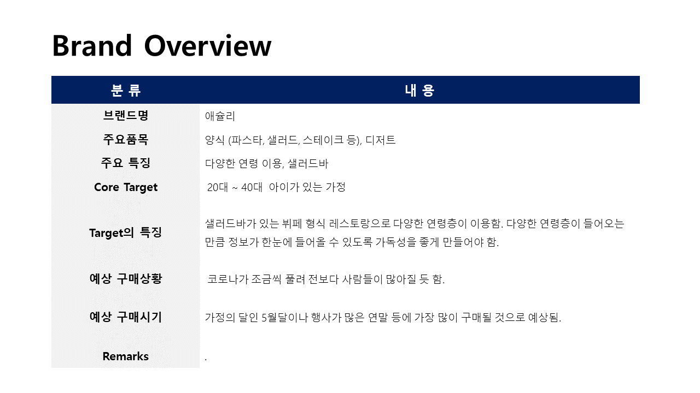
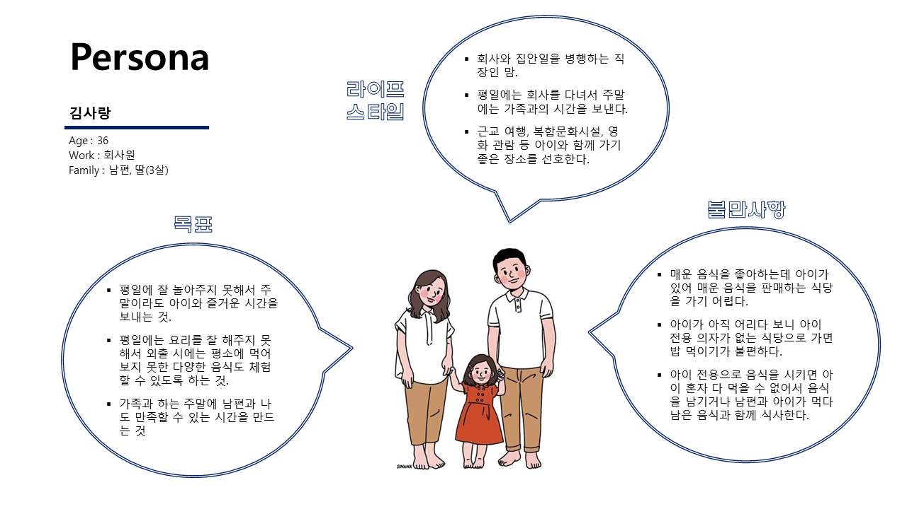
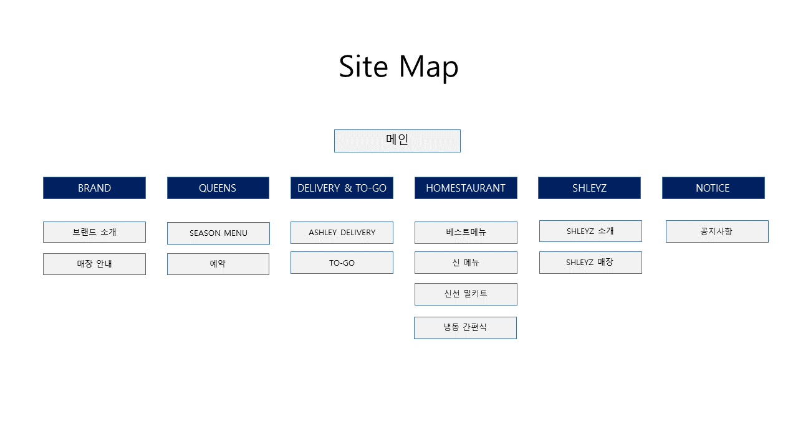

# :plate_with_cutlery: ASHLEY

:lollipop: 외식브랜드 애슐리의 사이트를 **심플**하고 **한 눈에 들어오는 디자인**으로 리뉴얼하였습니다.
 
 

---
## About
:cupcake: **사용 소스**: HTML, CSS, JavaScript, Jquery
 
:cupcake: **작업 인원**: 1명
 

---
## :fork_and_knife: UI, UX 콘셉트 기획 
### :pizza: **Design Strategy**

### :green_salad: **Brand Overview**

### :poultry_leg: **Persona**

### :fried_shrimp: **Site Map**

---
## :fork_and_knife: Design Gide

---
## :link: Link
https://limjh0927.cafe24.com/profile/works/pages/ASHLEY/index.html
